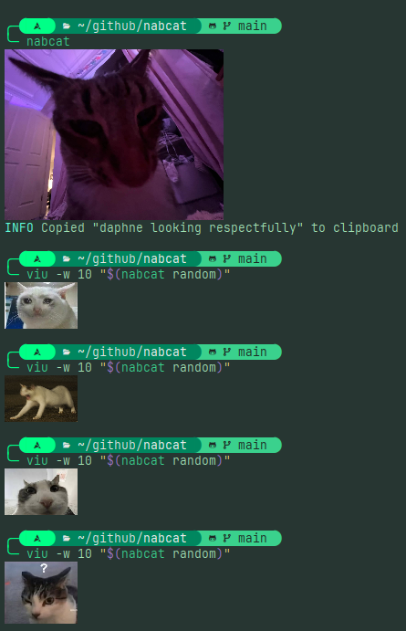

# nabcat
A niche terminal utility for quickly sending cat images to the clipboard.



`nabcat` is a single shell script written in `zsh` that lets you quickly copy cat pictures from `$HOME/Picutres/Cats/` to the system clipboard. 
It works well within scripts, yet has convenient default behavior.
Running `nabcat` without arguments is equivalent to running `viu -w 30 "$(nabcat choose -cr)"` if you have `viu` installed, and `nabcat choose -cr` if you don't.
# How to Get Nabcat
## Dependencies
First, ensure that dependencies are satisfied.
### Configuration Parser
`nabcat` uses [yq](https://github.com/mikefarah/yq) to parse its config file. This dependency is required.
### Interactive Cat Picker
`nabcat` is set up to use [fzf](https://github.com/junegunn/fzf) as the default picker, incorporating [icat](https://github.com/atextor/icat) for real-time previews.
A backend definition that uses [gum](https://github.com/charmbracelet/gum) is also included in the default config file.
### Optional Terminal Image Viewer
`nabcat` is set up to use [viu](https://github.com/atanunq/viu?tab=readme-ov-file) as the default image viewer when `nabcat` is invoked without arguments. However, the script will detect if you have it installed before attempting to call it, so this dependency is optional.
### Clipboard functionality
If you are on `X11`, install `xsel` to allow nabcat to send selected cats to your clipboard.
If you are on `wayland`, install `wl-clipboard` instead.

### Additional Programs
if you write your own backend-definitions, you obviously need to install the programs being invoked.
## Installation
To install, simply place `nabcat.zsh` somewhere in `$PATH`, and grant executable permissions. Then, place `nabcat.yaml` in `~/.config`. Finally, enable the backends you want to use in the config.

# How to use Nabcat
## Setting up the Cat folder
Unfortunately, the cats themselves are not included with the program.
By default, `nabcat` looks in `$HOME/Pictures/Cats/` for cat images.
If you want to change this behavior, the environment variable `NABCAT_CAT_DIR` can be set to a custom location. BE SURE TO INCLUDE A TRAILING SLASH IN THE VALUE!
> [!WARNING]
> This environment variable will be depreciated in version 3.x.x

Alternatively, `nabcat` commands that accept the `-d` flag allow you to specify a location in which to look for images. Make sure that the value passed to this flag includes a trailing slash.
## Getting a cat
Running `nabcat` without arguments invokes an interactive menu listing all cats in the Cats folder. Fuzzy searching is supported within the menu.
If you already know the name of the image you want to retrieve, running `nabcat get` lets you specify the name of the file (without the extension) without having to invoke the menu. However, the selected cat will not be automatically previewed, so if you want that, set up an alias.
If you don't care what cat you get, running `nabcat random` will return the path to a random cat in the folder.

For more information, run `nabcat help`, optionally passing the name of a command.

## Configuring Nabcat
`nabcat` looks for a YAML file named `nabcat.yaml` in `$XDG_CONFIG_HOME`. The format of this file is as follows:
### `env`
Contains values that define default behavior.
| key | Default | Desc |
| --- | ------- | ---- |
| `cat-dir` | `~/Pictures/Cats/` | Where to look for cats |
| `do-copy` | `true` | whether to copy to the clipboard by default |
| `verbose` | `false` | verbose output |
| `return-found` | `true` | whether to print the name of a cat if one is found. |  

### `backend-defs`
Contains three sections: `clipboard`, `viewer`, and `picker`.
Each section contains a list of anchored commands without quotes. This allows additional backends to easily be defined and used.
### `backends`
Contains three keys corresponding to the sections in `backend-defs`. the value of each one should be a reference to one of the anchors defined in the corresponding section.
# Considerations
- `wl-clipboard` currently has a bug that prevents GIFs and PNGs from being copied to the clipboard. To avoid this, save all cats as PNGs.
- If the filenames of your cats contain spaces, you'll need to enclose the call to `nabcat` within quotes like so:
```shell
some_other_command "$(nabcat get -r 'critically orange cat')"
```
- `viu`'s performance can be impacted by high-resolution images. If you have an alternative, define a integration for it in the config.
